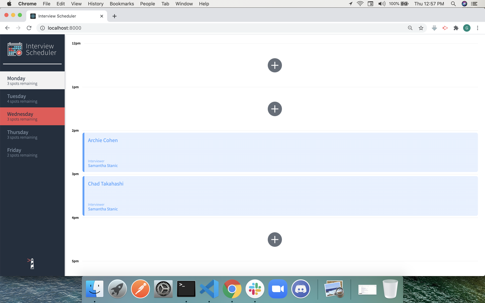
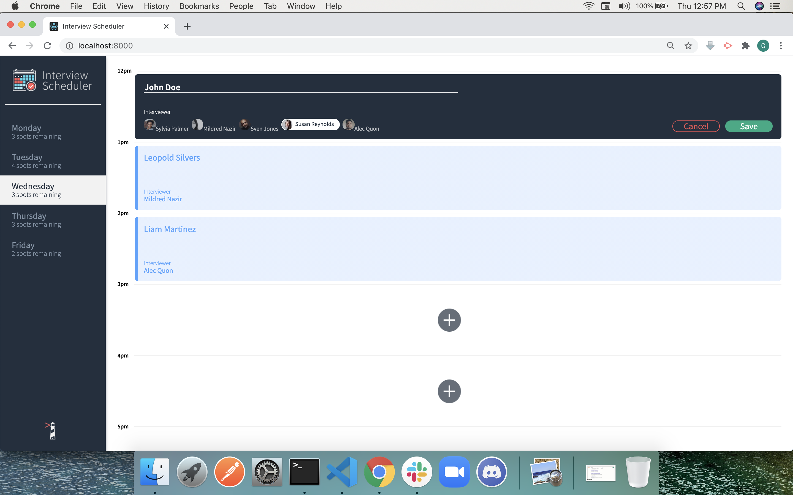
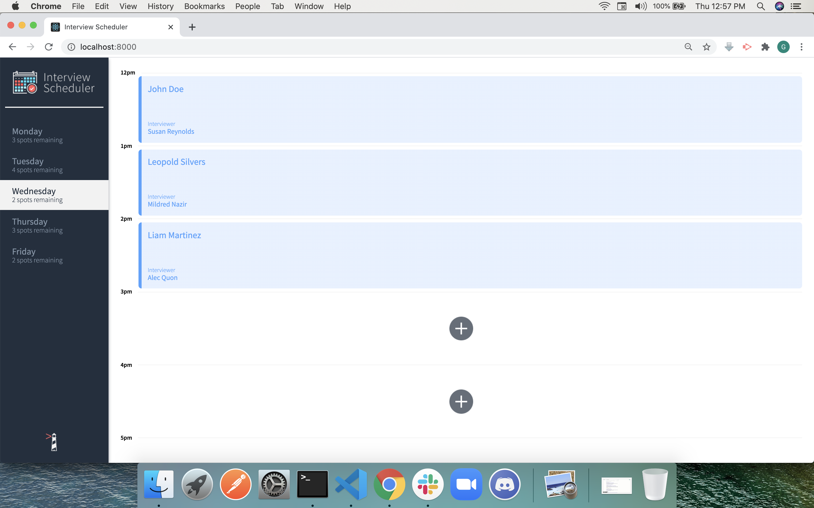

# Interview Scheduler

This schedule app allows users to store, create, edit and delete interview appointments. It uses HTML5, CSS3, React, Express, PosgreSQL, and Node. 

## Final Product

Click on the Days panel to choose the day of week.

Enter the students name and select an interviewer.

The newly created appointment will be displayed and stored to the backend.

## Getting Started
1. Create a backend for the project. Following the instructions listed in [scheduler-api](https://github.com/lighthouse-labs/scheduler-api).
2. This project requires the node version of 10.16.1. If not installed, install with `nvm install v10.16.1`.
2. Use node version 10.16.1 (using the `nvm use v.10.16.1` command)
2. Install all dependencies for this app (using the `npm install` command).
3. Run command: `npm start`

## Dependencies

- axios
- classnames
- normalize.css
- react
- react-dom
- react-hooks-testing-library
- react-scripts